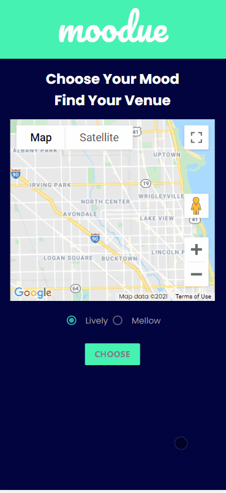

# moodue

Moodue is an events services. This let's the users get local events based on their mood. By the user choosing the mood "Lively" or "Mellow", it will show concerts and movie options.

# Useful

The interface is desktop and mobile version friendly.
The web app is easy to use, by the users having 2 choices. This allows moodue to filter and show the events for them.

# Getting Started

1. In the middle of the page it has 2 radio choices, which are lively and mellow that the user can choose from.

2. Once the user chooses their mood it populates the events.

3. All of this is based on the users location by using google maps.

4. The users can change their mood if they are not content with the results.

# Demos

### Technologies and APIs used:

- HTML was used to structure the web page.
- Google Fonts was used for the brand logo adding cursive style.
- Bootstrap was used for styling the navbar.
- Materialize was used for styling the container and the footer.
- CSS was used for positioning the image and sizing the fonts and color.
- JavaScript was used to fetch the api, loop and used for the basic funtionality of the application.
- Google Maps was used for the users current location.
- Mockaroo was used for movie options.

# Deployed Application

https://tmallz.github.io/moodue/

# Retrospective

We started with an idea were we wanted to intergrate music, restaurants and all events. We had some APIs that were no longer available. That's when we decided to restructure our ideas. Our team worked together to suppport and guide each other in every different phase of the project. Alicia and Timothy came out with the name. First it started with eventify, Alicia wanted to integrate the users mood with events. That's how the name moodue came out to be. Diego did the second mock up using google drawings. Timothy was assigned to work with JavaScript and the basic funtionalities of the application. Diego worked on the HTML and CSS. Alicia also worked on the HTML and CSS. Throughout the length of the project we all motivated each other and communicated well.
